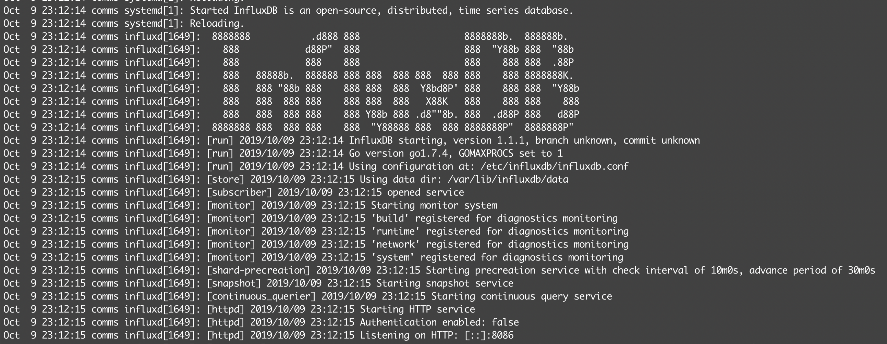

# Lemongrass

This repo is where I keep the tools I use to work on my 24 Hours of Lemons team.

## Telem

### How to Use `telem.py`

1. Set up an influxDB instance.


```plain
> create user tom_admin with password 'THIS_IS_A_SECRET_TWAT' WITH ALL PRIVILEGES
> SHOW USERS
user		admin
----		-----
tom_admin	true

> CREATE USER car_252 WITH PASSWORD 'HEY_I_SAID_NO_PEEKING'
> SHOW USERS
user		admin
----		-----
tom_admin	true
car_252		false

> show databases
name: databases
name
----
_internal
stats_252

> grant write on stats_252 to car_252
```

2. Plug in a USB OBD Scanner and point telem at that instance.

```python
client = InfluxDBClient('race.focism.com', 8086, 'car_252', 'HEY_I_SAID_NO_PEEKING', 'stats_252')
```

3. Git goin.

## Laps

### How to Use `laps.py`

1. Get a Race Monitor API token
<https://www.race-monitor.com/Home/API>

2. Put your token in a dotfile named token in the root of the project folder

3. Get your race ID

We need a Race ID to get information for. Head to <https://www.race-monitor.com/Live/Race> while your race is live to get this easily from the URL.


4. Run the tool

Usage:

```shell
./laps.py RACE_ID CAR_NUMBER
```

```shell
18:40 $ ./laps.py 97220 252
2020-08-08 18:40:54,188 - INFO - Race 97220 is currently live.
--------------------------------------------------------------------------------
24 Hours of Lemons-Chargoggagogg	Started: 2020-08-07 09:00:00
Thompson Motor Speedway			Ends: 2020-08-08 18:00:00
--------------------------------------------------------------------------------
--------------------------------------------------------------------------------
Pos. #    First Name                       Laps Competitor ID   Transponder ID
--------------------------------------------------------------------------------
1    992  SillyNannies2                    336  992             2-30
2    71   3 Pedal Mafia                    336  71              5409914
3    41   3 Pedal Mafia                    335  41              9320976
4    173  Bazinga Racing                   334  173             9237171
5    99   FRS's Ugly Uncle                 334  99              1-28
6    39   Overengineer'd Racing            326  39              725404
7    88   88 Shades of Gray                325  88              1-24
8    213  SiSo Motorsports                 323  213             2-10
9    402  PunisherGP                       322  402             2-20
10   928  Scuderia Craptastic              321  928             2-28
11   496  Moot Point Racing                319  496             2-23
12   969  C-Team                           316  969             2-29
13   90   HAMMotorsports                   312  90              1-25
14   21   The Slow and Mello               312  21              1-6
15   55   Lemontarians                     305  55              1-12
16   2    Murder Whorenet                  305  2               3568627
17   292  SillyNannies3                    305  292             2-12
18   306  BostonWhiners                    302  306             8299765
19   44   Wrecktum                         302  44              343902
20   82   B.A.R.F Motorsports              301  82              1548772
21   188  ALDS Assassins                   294  188             2-7
22   777  Matt Ferenchak Motorsport (Silent But Deadly Racing) 293  777             961222
23   461  Dumb As A Brick                  293  461             5348517
24   316  Hit 'Em With the Hein Racing     290  316             2-16
25   199  FRS Ugly Uncle 2                 286  199             2-8
26   46   Brooklyn Bomb Squad              285  46              1-11
27   444  BostonWhiners                    281  444             3934044
28   4    Flame Car Racing                 280  4               1-2
29   79   Hopes & Dreams Racing            280  79              1-19
30   5    Duhhh-kota                       279  5               404255
31   8    Team Duty                        278  8               1957371
32   495  All Rhodes Racing                278  495             5682943
33   85   Rusty Tear Racing                274  85              1-23
34   133  Cannibal Cafe Racing             273  133             9046109
35   442  Punisher GP                      269  442             1904613
36   3    Lemontarians                     267  3               1-1
37   252  Church of Focism                 264  252             2-11
38   196  Pro Bandaid Solutions            263  196             702279
39   32   MarioKart Driving School /Bratva 263  32              1510569
40   20   Del sol                          261  20              1-5
41   351  The  Cosmonaughts                260  351             2-18
42   48   We Audi Be Faster I              259  48              1042046
43   835  Top Off Racing                   258  835             9304196
44   74   THE MIB                          256  74              1-17
45   111  Team Mean and the Mechanics      256  111             2-2
46   900  Saabs of Anarchy                 254  900             2-27
47   84   Altimate Warrior Racing          250  84              1-22
48   143  Neutralize And Destroy Racing    250  143             2-6
49   34   What are lug nuts?               245  34              1-8
50   36   The Rootes of All Evil           235  36              1-9
51   115  Twisted Metal                    234  115             2-3
52   70   Ghetto Art Rabbit                233  70              1-16
53   96   Our Mid Life Crisis              231  96              1-27
54   66   The Rowdy Rednecks               213  66              1-14
55   528  Lemons Plumbing and RACING       201  528             2-24
56   93   11th Chance                      201  93              1-26
57   314  The Science Project              195  314             2-15
58   888  Mome Rath Racing                 182  888             2-26
59   222  Monkey House Racing              173  222             8177356
60   60   Team Napa know it all's          171  60              1-13
61   54   Somtingwong                      152  54              4193016
62   13   Century Motor Cars               145  13              1-4
63   424  Old Guys with Angry Wives        113  424             2-21
64   609  Cheesebolt Enterprises           111  609             2-25
65   104  Days Asunder (Burgess Brothers Racing) 109  104             1-30
66   447  The Flying Scotsmen              99   447             2-22
67   15   Nuthin' but a Z Thang            93   15              238308
68   33   Great Globs of Oil /Bratva       93   33              1519918
69   108  Frankenvette                     91   108             2-1
70   299  SillyNannies                     87   299             2-14
71   363  La Fiesta                        82   363             2-19
72   295  WeLikeTheTunaHere                79   295             2-13
73   206  British Empire Strikes Back      77   206             2-9
74   350  Scuderia VICTOR Motorsports      33   350             2-17
75   482  Dead Horse Beaters               29   482             8012270
76   30   Tuga Racing                      23   30              1-7
77   147  Floodstang                       11   147             8746044
78   101  Lemons Appliance Repair          7    101             1-29
79   121  Outatime                         2    121             2-5
--------------------------------------------------------------------------------
--------------------------------------------------------------------------------
Team: Church of Focism Car Number: 252  Transponder: 2-11
Best Position:	58
Final Position:	37
Total Laps:	264
Best Lap:	179
Best Lap Time:	00:01:34.193
Total Time:	09:23:15.171
--------------------------------------------------------------------------------
 Lap Position       LapTime FlagStatus     TotalTime
   1       26  00:01:45.379      Green  00:02:34.250
   2       26  00:02:03.099     Yellow  00:04:37.349
   3       26  00:02:11.629     Yellow  00:06:48.978
   4       26  00:02:15.882     Yellow  00:09:04.860
   5       28  00:01:53.610      Green  00:10:58.470
   6       30  00:01:51.507      Green  00:12:49.977
   7       32  00:01:47.735      Green  00:14:37.712
   8       36  00:01:41.991      Green  00:16:19.703
   9       38  00:01:39.655      Green  00:17:59.358
  10       36  00:01:38.087      Green  00:19:37.445
  11       38  00:01:37.699      Green  00:21:15.144
  12       39  00:01:48.103      Green  00:23:03.247
  13       41  00:01:44.441      Green  00:24:47.688
  14       42  00:01:40.792      Green  00:26:28.480
  15       42  00:01:38.426      Green  00:28:06.906
  16       42  00:01:36.631      Green  00:29:43.537
  17       42  00:01:36.483      Green  00:31:20.020
  18       42  00:01:37.508      Green  00:32:57.528
  19       42  00:01:35.672      Green  00:34:33.200
  20       41  00:01:37.211      Green  00:36:10.411
  21       41  00:01:37.791      Green  00:37:48.202
  22       41  00:01:38.711      Green  00:39:26.913
  23       39  00:01:38.341      Green  00:41:05.254
  24       39  00:01:36.542      Green  00:42:41.796
  25       38  00:01:39.279      Green  00:44:21.075
  26       38  00:01:37.014      Green  00:45:58.089
  27       37  00:01:39.575      Green  00:47:37.664
  28       37  00:01:37.608      Green  00:49:15.272
  29       36  00:01:37.570      Green  00:50:52.842
  30       36  00:01:47.105      Green  00:52:39.947
  31       36  00:01:48.300      Green  00:54:28.247
  33       35  00:02:12.722      Green  00:58:42.239
  34       34  00:01:58.561      Green  01:00:40.800
  35       34  00:01:39.534      Green  01:02:20.334
  36       33  00:01:39.494      Green  01:03:59.828
  37       32  00:01:43.372      Green  01:05:43.200
  38       32  00:01:40.750      Green  01:07:23.950
  39       32  00:01:39.235      Green  01:09:03.185
  40       31  00:01:39.042      Green  01:10:42.227
  41       30  00:01:41.509      Green  01:12:23.736
  42       29  00:01:44.258      Green  01:14:07.994
  43       30  00:01:37.784      Green  01:15:45.778
  44       30  00:01:39.680      Green  01:17:25.458
  45       32  00:01:54.377      Green  01:19:19.835
  46       36  00:05:34.124      Green  01:24:53.959
  47       35  00:01:39.900      Green  01:26:33.859
  48       34  00:01:39.894      Green  01:28:13.753
  49       33  00:01:40.627      Green  01:29:54.380
  50       33  00:01:40.150      Green  01:31:34.530
  51       33  00:01:41.280      Green  01:33:15.810
  52       33  00:01:40.494      Green  01:34:56.304
  53       33  00:01:37.985      Green  01:36:34.289
  54       33  00:01:39.065      Green  01:38:13.354
  55       33  00:01:39.798      Green  01:39:53.152
  56       33  00:01:39.788      Green  01:41:32.940
  57       32  00:01:41.565      Green  01:43:14.505
  58       31  00:01:40.452      Green  01:44:54.957
  59       31  00:01:42.507      Green  01:46:37.464
  60       31  00:01:40.762      Green  01:48:18.226
  61       30  00:01:40.649      Green  01:49:58.875
  62       32  00:01:42.428      Green  01:51:41.303
  63       32  00:01:42.696      Green  01:53:23.999
  64       31  00:01:44.293      Green  01:55:08.292
  65       31  00:01:41.799      Green  01:56:50.091
  66       31  00:01:41.043      Green  01:58:31.134
  67       31  00:01:41.180      Green  02:00:12.314
  68       31  00:01:41.635      Green  02:01:53.949
  69       30  00:01:43.641      Green  02:03:37.590
  70       30  00:01:38.992      Green  02:05:16.582
  71       30  00:02:01.593      Green  02:07:18.175
  72       37  00:09:57.840     Yellow  02:17:16.015
  73       37  00:03:04.719     Yellow  02:20:20.734
  74       36  00:02:18.211      Green  02:22:38.945
  75       34  00:01:45.047      Green  02:24:23.992
  76       34  00:01:44.730      Green  02:26:08.722
  77       34  00:01:46.830      Green  02:27:55.552
  78       34  00:01:40.962      Green  02:29:36.514
  79       34  00:01:48.335      Green  02:31:24.849
  80       34  00:01:46.940      Green  02:33:11.789
  81       34  00:01:47.511      Green  02:34:59.300
  82       34  00:02:02.436      Green  02:37:01.736
  83       34  00:02:36.044     Yellow  02:39:37.780
  84       34  00:02:15.809     Yellow  02:41:53.589
  85       34  00:02:22.273     Yellow  02:44:15.862
  86       34  00:01:53.292      Green  02:46:09.154
  87       34  00:01:41.319      Green  02:47:50.473
  88       33  00:01:41.453      Green  02:49:31.926
  89       34  00:01:39.960      Green  02:51:11.886
  90       33  00:01:54.043      Green  02:53:05.929
  91       33  00:01:41.305      Green  02:54:47.234
  92       32  00:01:38.196      Green  02:56:25.430
  93       32  00:01:44.043      Green  02:58:09.473
  94       32  00:01:51.450      Green  03:00:00.923
  95       30  00:01:51.324      Green  03:01:52.247
  96       30  00:01:52.975      Green  03:03:45.222
  97       29  00:01:55.410      Green  03:05:40.632
  98       29  00:01:46.180      Green  03:07:26.812
  99       29  00:01:42.805      Green  03:09:09.617
 100       29  00:01:42.885      Green  03:10:52.502
 101       29  00:01:39.652      Green  03:12:32.154
 102       29  00:01:38.160      Green  03:14:10.314
 103       28  00:01:49.195      Green  03:15:59.509
 104       27  00:01:43.141      Green  03:17:42.650
 105       27  00:01:39.382      Green  03:19:22.032
 106       27  00:01:42.212      Green  03:21:04.244
 107       26  00:01:49.608      Green  03:22:53.852
 108       26  00:01:46.566      Green  03:24:40.418
 109       26  00:01:46.904      Green  03:26:27.322
 110       26  00:01:38.528      Green  03:28:05.850
 111       26  00:01:37.347      Green  03:29:43.197
 112       26  00:01:43.126      Green  03:31:26.323
 113       23  00:01:43.090      Green  03:33:09.413
 114       23  00:01:40.179      Green  03:34:49.592
 115       23  00:01:42.370      Green  03:36:31.962
 116       23  00:01:42.336      Green  03:38:14.298
 117       22  00:01:37.461      Green  03:39:51.759
 118       22  00:01:38.982      Green  03:41:30.741
 119       22  00:01:40.944      Green  03:43:11.685
 120       22  00:01:40.968      Green  03:44:52.653
 121       22  00:01:40.362      Green  03:46:33.015
 122       22  00:01:40.982      Green  03:48:13.997
 123       22  00:01:37.922      Green  03:49:51.919
 124       22  00:01:43.161      Green  03:51:35.080
 125       23  00:01:46.048      Green  03:53:21.128
 126       23  00:01:38.416      Green  03:54:59.544
 127       22  00:01:42.216      Green  03:56:41.760
 128       22  00:01:38.988      Green  03:58:20.748
 129       22  00:01:37.557      Green  03:59:58.305
 130       22  00:01:39.832      Green  04:01:38.137
 131       22  00:01:42.625      Green  04:03:20.762
 132       22  00:01:39.727      Green  04:05:00.489
 133       22  00:01:41.045      Green  04:06:41.534
 134       22  00:01:38.231      Green  04:08:19.765
 135       22  00:01:39.251      Green  04:09:59.016
 136       22  00:01:39.866      Green  04:11:38.882
 137       22  00:01:39.781      Green  04:13:18.663
 138       22  00:01:39.703      Green  04:14:58.366
 139       22  00:01:40.314      Green  04:16:38.680
 140       23  00:01:41.891      Green  04:18:20.571
 141       23  00:01:42.129      Green  04:20:02.700
 142       23  00:01:41.148      Green  04:21:43.848
 143       23  00:01:38.029      Green  04:23:21.877
 144       23  00:01:42.390      Green  04:25:04.267
 145       23  00:01:39.991      Green  04:26:44.258
 146       23  00:01:40.827      Green  04:28:25.085
 147       23  00:01:37.301      Green  04:30:02.386
 148       23  00:01:39.207      Green  04:31:41.593
 149       23  00:01:46.317      Green  04:33:27.910
 150       47  00:58:59.413      Green  05:32:27.323
 151       48  00:05:56.580      Green  05:38:23.903
 152       48  00:02:24.301      Green  05:40:48.204
 153       48  00:01:36.346      Green  05:42:24.550
 154       48  00:01:39.212      Green  05:44:03.762
 155       48  00:01:35.918      Green  05:45:39.680
 156       48  00:01:38.334      Green  05:47:18.014
 157       48  00:01:46.760      Green  05:49:04.774
 158       48  00:01:38.314      Green  05:50:43.088
 159       48  00:01:37.999      Green  05:52:21.087
 160       48  00:02:21.937      Green  05:54:43.024
 161       53  00:28:42.196      Green  06:23:25.220
 162       53  00:01:36.743      Green  06:25:01.963
 163       53  00:01:43.221      Green  06:26:45.184
 164       52  00:01:38.459      Green  06:28:23.643
 165       52  00:01:35.387      Green  06:29:59.030
 166       52  00:01:36.596      Green  06:31:35.626
 167       52  00:01:37.347      Green  06:33:12.973
 168       52  00:01:34.595      Green  06:34:47.568
 169       52  00:01:40.366      Green  06:36:27.934
 170       52  00:01:38.256      Green  06:38:06.190
 171       52  00:01:37.326      Green  06:39:43.516
 172       52  00:01:37.955      Green  06:41:21.471
 173       52  00:01:37.954      Green  06:42:59.425
 174       51  00:01:39.562      Green  06:44:38.987
 175       51  00:01:52.273      Green  06:46:31.260
 176       51  00:01:38.342      Green  06:48:09.602
 177       51  00:01:36.357      Green  06:49:45.959
 178       51  00:01:36.671      Green  06:51:22.630
 179       51  00:01:34.193      Green  06:52:56.823
 180       50  00:01:36.551      Green  06:54:33.374
 181       50  00:01:38.503      Green  06:56:11.877
 182       50  00:01:36.099      Green  06:57:47.976
 183       49  00:01:39.178      Green  06:59:27.154
 184       49  00:01:34.417      Green  07:01:01.571
 185       49  00:01:44.368      Green  07:02:45.939
 186       48  00:01:39.294      Green  07:04:25.233
 187       48  00:01:43.198      Green  07:06:08.431
 188       48  00:01:36.908      Green  07:07:45.339
 189       48  00:01:39.327      Green  07:09:24.666
 190       47  00:01:36.117      Green  07:11:00.783
 191       47  00:01:37.799      Green  07:12:38.582
 192       47  00:01:36.986      Green  07:14:15.568
 193       47  00:01:37.287      Green  07:15:52.855
 194       47  00:01:39.848      Green  07:17:32.703
 195       47  00:01:37.112      Green  07:19:09.815
 196       45  00:01:37.507      Green  07:20:47.322
 197       44  00:01:37.203      Green  07:22:24.525
 198       43  00:01:38.452      Green  07:24:02.977
 199       43  00:01:37.060      Green  07:25:40.037
 200       43  00:01:38.393      Green  07:27:18.430
 201       43  00:01:38.068      Green  07:28:56.498
 202       43  00:01:42.455      Green  07:30:38.953
 203       43  00:01:37.923      Green  07:32:16.876
 204       43  00:01:41.184      Green  07:33:58.060
 205       43  00:01:39.022      Green  07:35:37.082
 206       43  00:01:35.324      Green  07:37:12.406
 207       43  00:01:38.193      Green  07:38:50.599
 208       43  00:01:36.548      Green  07:40:27.147
 209       44  00:01:49.471      Green  07:42:16.618
 210       47  00:06:26.005      Green  07:48:42.623
 211       47  00:01:42.593      Green  07:50:25.216
 212       46  00:01:44.482      Green  07:52:09.698
 213       46  00:01:40.018      Green  07:53:49.716
 214       46  00:01:41.909      Green  07:55:31.625
 215       46  00:01:38.253      Green  07:57:09.878
 216       46  00:01:39.798      Green  07:58:49.676
 217       46  00:01:37.646      Green  08:00:27.322
 218       46  00:01:40.966      Green  08:02:08.288
 219       46  00:01:38.252      Green  08:03:46.540
 220       46  00:01:42.345      Green  08:05:28.885
 221       46  00:01:38.958      Green  08:07:07.843
 222       46  00:01:42.453      Green  08:08:50.296
 223       46  00:01:45.473      Green  08:10:35.769
 224       46  00:01:40.297      Green  08:12:16.066
 225       45  00:01:43.203      Green  08:13:59.269
 226       45  00:01:45.129      Green  08:15:44.398
 227       45  00:01:40.069      Green  08:17:24.467
 228       43  00:01:43.153      Green  08:19:07.620
 229       43  00:01:41.675      Green  08:20:49.295
 230       43  00:01:42.529      Green  08:22:31.824
 231       43  00:01:53.254      Green  08:24:25.078
 232       42  00:01:44.116      Green  08:26:09.194
 233       41  00:01:47.284      Green  08:27:56.478
 234       41  00:01:47.053      Green  08:29:43.531
 235       41  00:01:41.597      Green  08:31:25.128
 236       41  00:01:55.707      Green  08:33:20.835
 237       41  00:04:58.196      Green  08:38:19.031
 238       41  00:01:38.675      Green  08:39:57.706
 239       41  00:01:38.143      Green  08:41:35.849
 240       41  00:01:40.644      Green  08:43:16.493
 241       41  00:01:41.136      Green  08:44:57.629
 242       41  00:01:39.567      Green  08:46:37.196
 243       41  00:01:39.240      Green  08:48:16.436
 244       40  00:01:37.965      Green  08:49:54.401
 245       40  00:01:37.037      Green  08:51:31.438
 246       40  00:01:39.234      Green  08:53:10.672
 247       40  00:01:48.011      Green  08:54:58.683
 248       40  00:01:39.051      Green  08:56:37.734
 249       39  00:01:39.420      Green  08:58:17.154
 250       39  00:01:39.767      Green  08:59:56.921
 251       37  00:01:42.841      Green  09:01:39.762
 252       37  00:01:44.810      Green  09:03:24.572
 253       37  00:01:39.593      Green  09:05:04.165
 254       37  00:01:38.192      Green  09:06:42.357
 255       37  00:01:38.335      Green  09:08:20.692
 256       37  00:01:38.404      Green  09:09:59.096
 258       37  00:01:37.382      Green  09:13:15.369
 259       37  00:01:42.667      Green  09:14:58.036
 260       37  00:01:45.076      Green  09:16:43.112
 261       37  00:01:38.517      Green  09:18:21.629
 262       37  00:01:37.928      Green  09:19:59.557
 263       37  00:01:37.258      Green  09:21:36.815
 264       37  00:01:38.356     Finish  09:23:15.171
--------------------------------------------------------------------------------
2020-08-08 18:40:55,462 - INFO - Writing lap times to Church of Focism-97220.csv
--------------------------------------------------------------------------------
```
